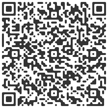

# svelte-kjua

A Svelte component that acts as a wrapper over [kjua](https://larsjung.de/kjua/) and makes beautiful QR codes.




## Install

```
npm install svelte-kjua
```


## Use:

```html
<script>
import QR from 'svelte-kjua'
</script>

<QR value="my content" size="{300}" color="black" />
```
